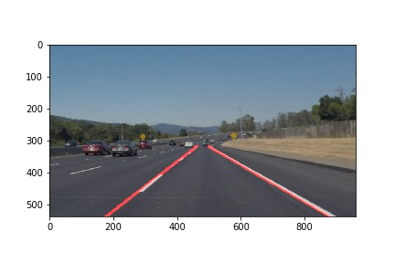
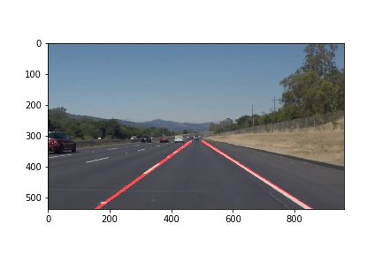
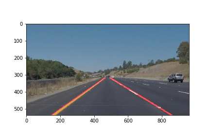
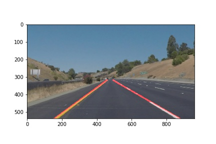
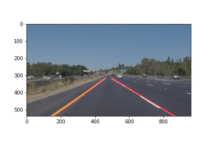
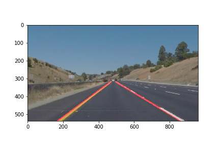

# **Finding Lane Lines on the Road** 

## Writeup

---

**Finding Lane Lines on the Road**

The goals / steps of this project are the following:
* Make a pipeline that finds lane lines on the road
* Reflect on your work in a written report

---

### Reflection

### 1. Describe your pipeline. As part of the description, explain how you modified the draw_lines() function.

#### The pipeline consisted of following steps
* Converted the images to grayscale
* Applied gaussian blur on the image
* Extracted edge lines using Canny edge detection
* Applied a mask to show only regions of interest where lane lines are expected to be found
* Applied Hough transform to the edges

#### In order to draw a single line on the left and right lanes
* Separated left lines and right lines based on positive/negative slopes
* Averaged out each set of lines by generating a best fit line using [numpy polyfit](https://docs.scipy.org/doc/numpy/reference/generated/numpy.polyfit.html)
* Using the output intercept and slope of the best fit line and the dimensions of the image, extrapolated the line to span the complete region of interest
* Overlayed the line on the original image
* The slope ranges (with padding) obtained by these best fit curves were used to filter outliers in the challenge video

### 2. Identify potential shortcomings with your current pipeline
* If the camera is mounted in a way that lane lines do not fit in the expected region of interest pipeline will fail
* Pipeline doesn't perform well with regions of shadow on the road

### 3. Suggest possible improvements to your pipeline
* Further tuning of parameters to better identify lane lines
* Dynamically identifying regions of interest and applying a mask
* Better solution for dealing with regions of shadows and brightness on the lane

#### Output Images

#### Output Videos

